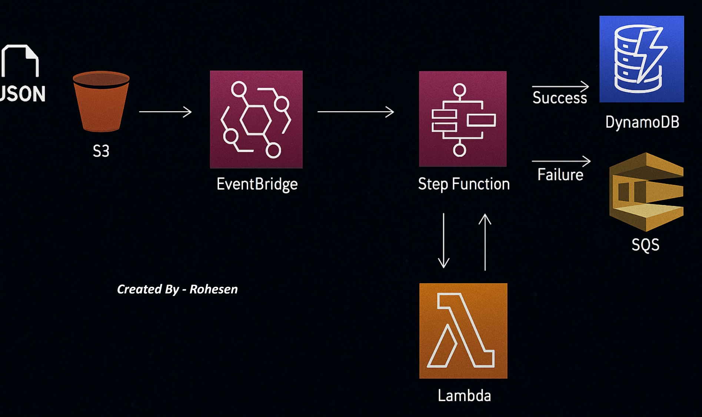
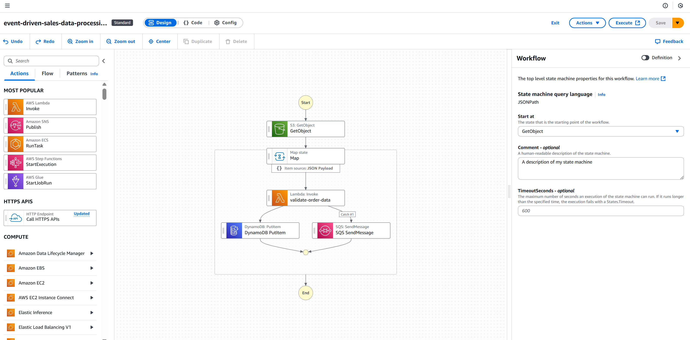
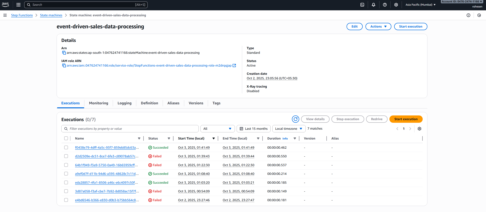
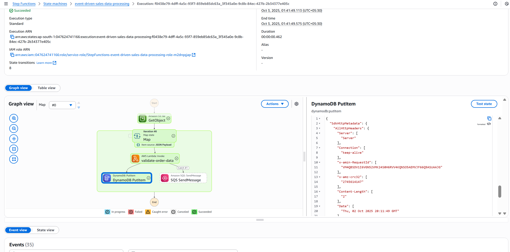
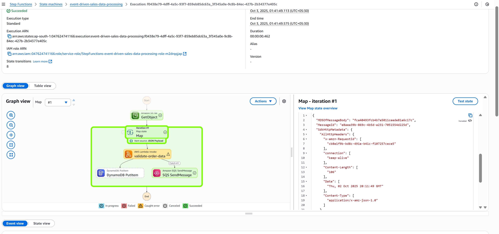
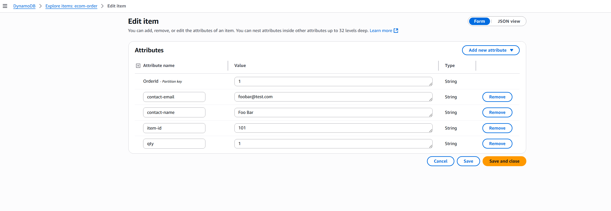
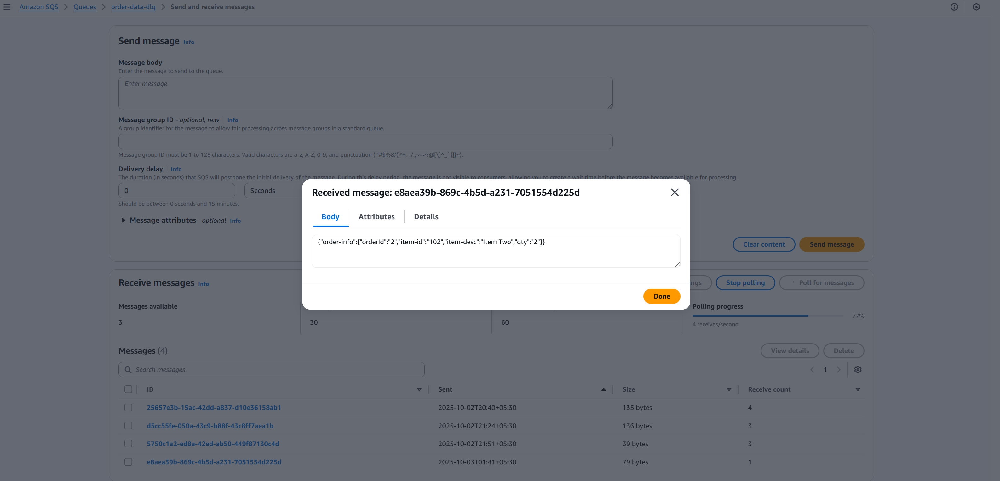

# Event_Driven_Sales_Data_Processing_using_AWS

* This project implements an **event-driven serverless data processing pipeline** on AWS for analyzing and storing e-commerce order data. 
* The system ingests order files from Amazon S3, validates them with AWS Lambda, persists valid orders in DynamoDB, and routes failed records to an SQS Dead Letter Queue (DLQ).

## 🏗️ Project Architecture

---

## 📌 Components

* **Amazon S3** – Ingest order files.
* **Amazon EventBridge** – Detects object creation events.
* **AWS Step Functions** – Orchestrates validation and routing.
* **AWS Lambda** – Validates orders (`order-json`).
* **Amazon DynamoDB** – Stores valid orders.
* **Amazon SQS** – Captures invalid orders in DLQ.

---

## ⚙️ Workflow

1. Upload a JSON file to the **`order-data-rohe`** S3 bucket.
2. EventBridge triggers the Step Functions state machine.
3. **Step Functions Execution**:

   * **GetObject** → Reads S3 object.
   * **Map State** → Iterates over each order.
   * **Lambda Validation** → Ensures `contact-info` exists.
   * **DynamoDB Write** → Saves valid orders.
   * **SQS DLQ** → Handles failed/invalid orders.

### State Machine Design

### Execution History

---

## 📊 Example Outputs

* **Delivered Orders**
  

* **Cancelled Orders**
  

* **DynamoDB Table Records**
  

* **SQS Dead Letter Queue Messages**
  

---

## 🛠️ Technologies

* Amazon S3
* Amazon EventBridge
* AWS Step Functions
* AWS Lambda
* Amazon DynamoDB
* Amazon SQS

---

## 🚀 Deployment Steps

1. Create an S3 bucket (`order-data-rohe`).
2. Deploy EventBridge rule (`event-bridge-rule.json`).
3. Create the Lambda function (`order-json`).
4. Set up DynamoDB table (`ecom-order`).
5. Set up SQS DLQ (`order-data-dlq`).
6. Deploy Step Functions (`stepfunction.json`).

---

## 📖 Future Enhancements

* Add AWS Glue for data transformations.
* Integrate Amazon QuickSight for dashboards.
* Expand retry/error handling strategies.

---

## 👨‍💻 Author

Built as a serverless **Event-Driven Sales Data Analysis** project using AWS.
